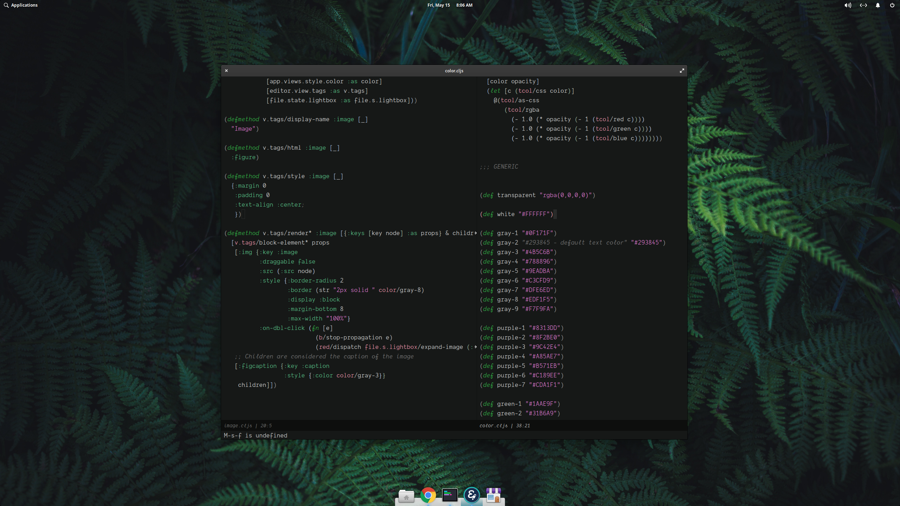
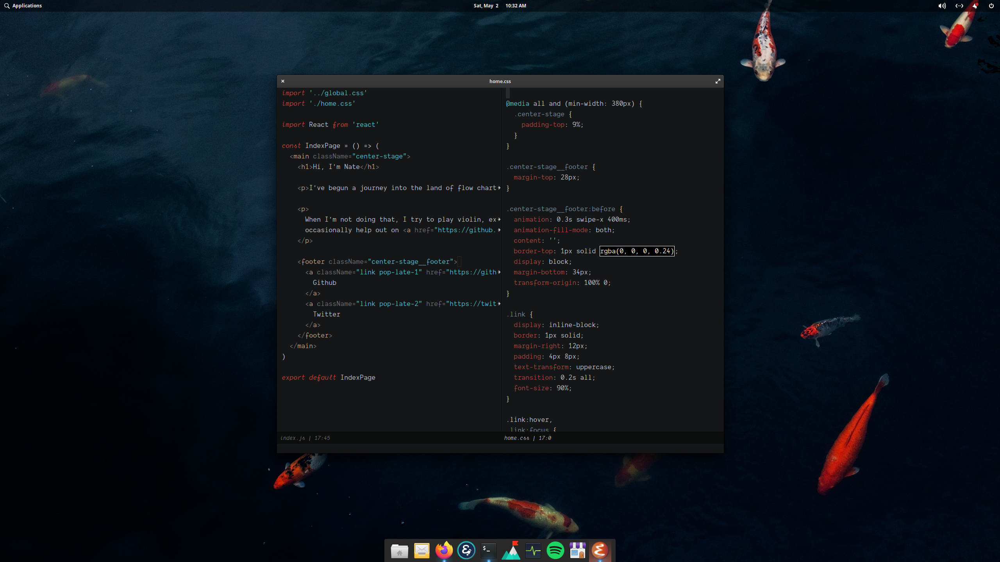
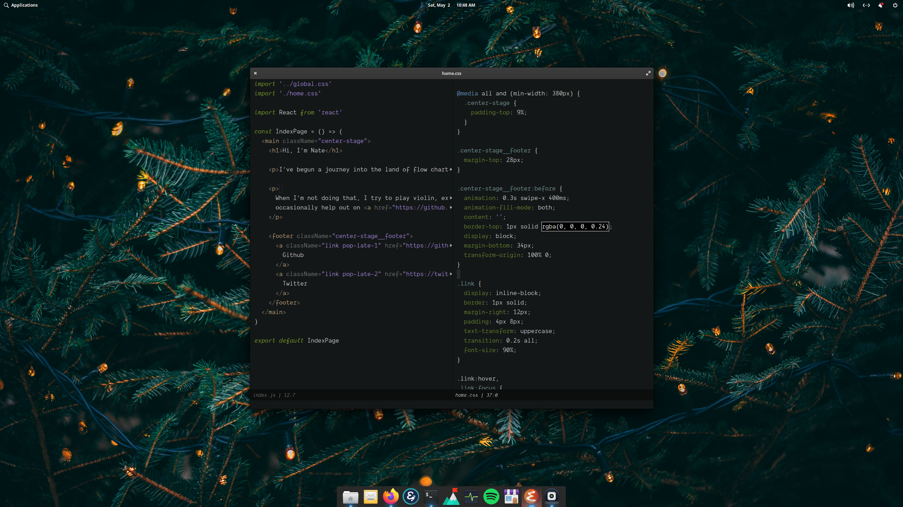
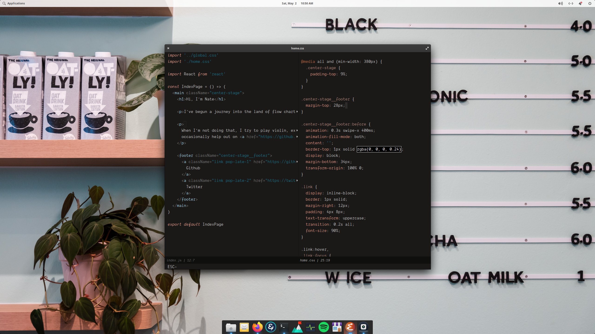
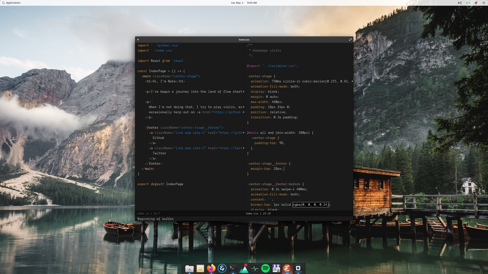

# Emacs Unsplash Themes

A compilation of scripts and guides to setup automatic theme creation
for random Unsplash wallpapers.

See [installation](./INSTALL.md) to get started.

## Example Themes

[Green Ferns, Nick Cooper](https://unsplash.com/photos/_1UF_3TlKcQ)

[Koi Fish, Alice Mourou](https://unsplash.com/photos/RrvGuqx-bOQ):

[Space Story, Joel Filipe](https://unsplash.com/photos/QwoNAhbmLLo):

[Tree Lights, Kieran White](https://unsplash.com/photos/SBdmQcW8qag):

[Lucky Arcade, Carl Raw](https://unsplash.com/photos/7H7KVCihBvI):

[Oat Milk, Wengang Zhai](https://unsplash.com/photos/LvUZACzeG1g):

[Wooden House, Luca Bravo](https://unsplash.com/photos/hFzIoD0F_i8):

[Golden Gate, Maarten van den Heuvel](https://unsplash.com/photos/gZXx8lKAb7Y):

